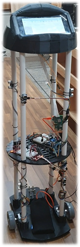

# K_Bot
라즈베리 파이를 이용한 도서관 서가 안내 로봇

## 주요 업무
* SketchUp를 통한 로봇 외형 설계
* 모터 작동 및 기계적 부하 인가 테스트
* 8개의 초음파 센서를 통한 장애물 감지
* 아두이노와 라즈베리 파이 연결
* 도서관 서가 구조 3D 모델링 및 체크포인트 저장
* 자이로 센서의 캘리브레이션을 통해 로봇 정지 시 초기 값 보정
* 목표 서가를 트리 자료구조로 구현하여 탐색
* 안드로이드 앱을 통한 책 검색 및 로봇과의 블루투스 연결
* 로봇 얼굴 UI 구현

## 본인 역할
* 8개의 초음파 센서를 OctoSonar 라이브러리를 활용하여 드라이버로 연결 후 아두이노와 통신
* 초음파 센서 데이터를 통해 장애물 감지 알고리즘 개발
* 도서관 서가 구조 3D 모델링 및 체크포인트 저장
* 자이로, 모터, 초음파 센서 통합
* 로봇 얼굴 UI 구현

## 결과
* 시뮬레이션 동영상:[![Youtube]](https://youtu.be/czI8dnMUCmI)
* 최종 로봇의 내부 

 
 
  
  

  
